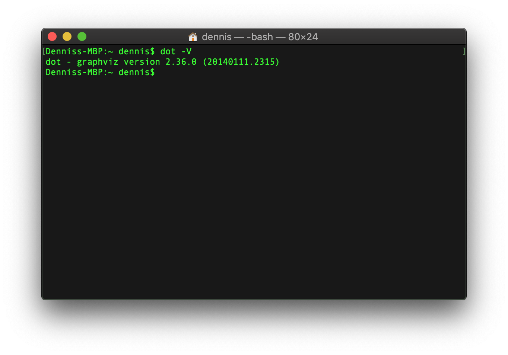
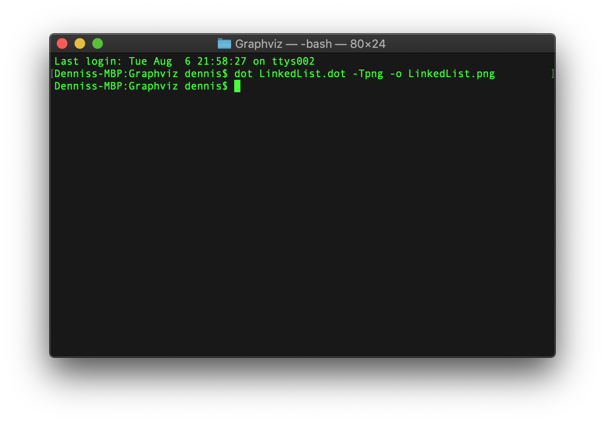
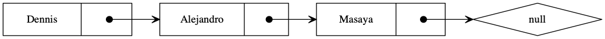

Is an open source **graph visualization** software, it’s a way to represent structural information as diagrams of abstract graphs and networks. In Data Structures it is particularly useful as it is a way to represent or graph the data structures we design thru code. As Graphviz is also a code oriented software usually is easier for coders or programmers to include Graphviz in their projects as a way to show their work, rather than explaining the code or using another kind of graphing or visualization software.
The Graphviz layout programs take descriptions of graphs in a simple text language, and make diagrams in useful formats, such as *png, jpg, etc*.  Graphviz has many useful features for concrete diagrams, such as options for colors, fonts, tabular node layouts, line styles, hyperlinks, and custom shapes. 

Let’s create our first graph using Graphviz thru the terminal

### Installation and Environment variables

First we will need to go to the [Graphviz download page](https://www.graphviz.org/download/) and download and install Graphviz to use on our computer.

We will need to install all the necessary software and define the necessary environment variables depending on our operative system, but once we have everything ready, we can run the following command.

``` bash
$ dot -V
```

and the system should tell us what version of Graphviz we have installed, once we see this message, we know we are ready to start using Graphviz.



Now that we have Graphviz installed the first thing we have to do is create a new file with the **.dot** extension int this file we will write everything necessary to create our first Graph, **DOT** language is the language that Graphviz uses to compile and generate Graphs so everything we will write from now on will be thru the DOT language.<br>

To create our first graph we will first choose the type of graph we are building (**graph | directed graph**), with the respective reserved words (**graph | digraph**), we will begin by typing our reserved word for our directed graph, followed by an ID and then a pair of curly brackets, inside this brackets we will write all the statements that will be necessary to build our directed graph.

``` graphviz
digraph firstGraph{
}
```

Now that we have our type of graph, we will start building our graph, first we will write a few statements that will define some aspects of our graph, the principal attributes used when building a graph are **node** to define how every node will look like, **edge** to define how every connecting line will look like, and finally a rank direction defined by the attribute **rankdir** that will tell our graph in which directions the elements will flow. Note that we will be using a couple of sub-attributes for each attribute, such as *shape, width, height, etc*. a complete list can be found in the [Graphviz Documentation](https://graphviz.gitlab.io/_pages/doc/info/attrs.html).

``` graphviz
node [shape=record, width=2.3, height=0.6];
edge [tailclip=false];
rankdir=LR; //Left to Right
```

The final section will be divided into 2 parts<br>
First we will define all our nodes, each node will have its unique **id**, and a **label**, we will divide our node in two parts, this can be done by dividing the label with the **|** character, and assigning an id to each side as follows **<id>**. We will also define a diamond shaped node that will help us simulate a null node.

``` graphviz
node1 [label="{<n> Dennis |<p>}"];
node2 [label="{<n> Alejandro |<p>}"];
node3 [label="{<n> Masaya |<p>}"];
null[shape=diamond];
```

Now that we have all our nodes defined, is time to connect them and we will define the connections as follows id -> id, we can also define what part of the node we want the arrow to point by using **:** and the second id, and finally if we want our arrow to come out of the center of that part we need to put **:** and the letter **c** (*center*), this is similar as accessing the attributes of an object by doing **student.name** (*node1:n in Graphviz*) in a programming language, and is this similarities that make Graphviz easy to use for programmers.

``` graphviz
node1:p:c -> node2:n [ arrowtail=dot, arrowhead=vee, dir=both ];
node2:p:c -> node3:n [ arrowtail=dot, arrowhead=vee, dir=both];
node3:p:c -> null [arrowtail=dot, arrowhead=vee, dir=both];
```

Now that we have successfully build our dot file, we need to compile this and generate a graph, this can be done thru the following command on our system terminal. We will reference our dot file, define the output type, (int this case png denoted by -Tpng) and finally the output (-o) file.

``` bash
$ dot LinkedList.dot -Tpng -o LinkedList.png
```

If everything worked ok our terminal will look like this, without any errors or warnings.



If we followed all of the necessary steps our graph should look something like this, and is easy to see why Graphviz is the main tool many programmers use when graphing data structures.


